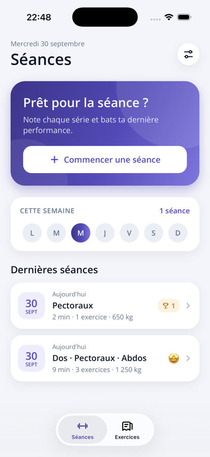
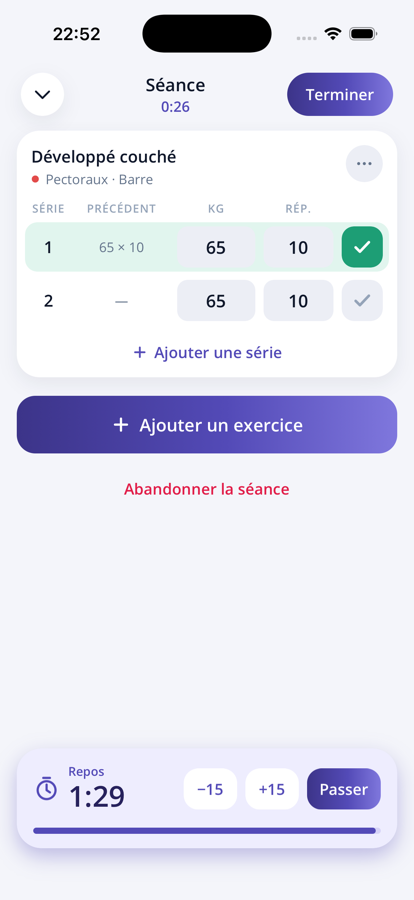
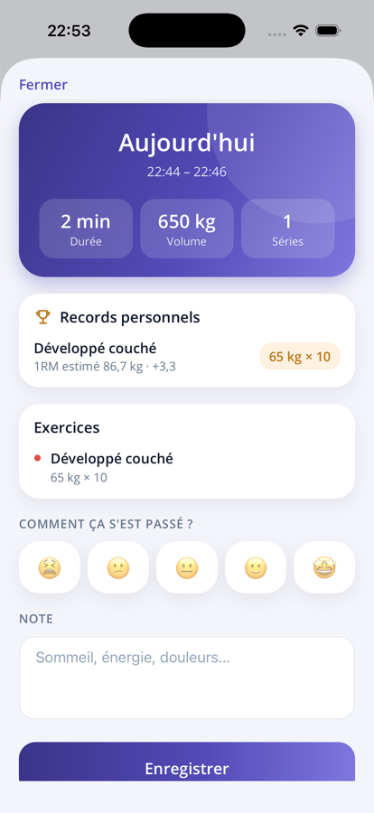
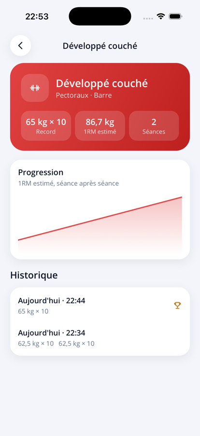
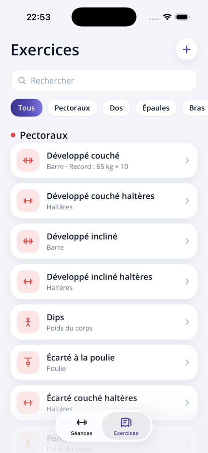
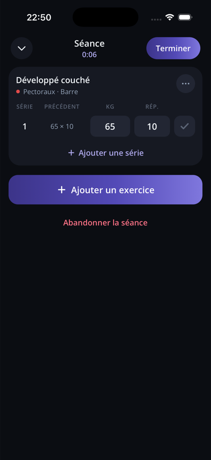

# Fonte

Carnet de musculation hors ligne : on note chaque série pendant la séance, l'app retrouve ce qui a été fait la fois d'avant, décompte le repos et repère les records. En **.NET MAUI 10** pour **iPhone, Android et Mac**.

| Accueil | Séance en cours | Fin de séance | Fiche exercice | Bibliothèque | Mode sombre |
|---|---|---|---|---|---|
|  |  |  |  |  |  |

## Fonctionnalités

- **Séances** (premier onglet) : commencer une séance ou reprendre celle en cours, la semaine en cours (jours entraînés et nombre de séances), et les dernières séances avec leurs groupes musculaires, durée, volume, ressenti et nombre de records.
- **Séance en cours** :
  - chronomètre depuis le début, écran maintenu allumé ;
  - un exercice ajouté reprend **les séries de la dernière fois** (charges et répétitions à battre), ou trois séries vides la première fois, avec la colonne « Précédent » en regard ;
  - saisie kg × répétitions, répétitions seules (pompes, tractions…) ou durée (secondes pour le gainage, minutes pour le cardio) ; toucher un champ sélectionne sa valeur, la frappe la remplace ;
  - une série validée remplit la suivante si elle est vide, et lance le **minuteur de repos** (±15 s, « Passer ») ; à la fin, bandeau et vibration dans l'app, **notification** si le téléphone est verrouillé ;
  - toucher le numéro d'une série pour la supprimer, « ⋯ » pour voir l'historique de l'exercice ou le retirer ;
  - « Terminer » ne garde que les séries validées ; une séance sans série validée est abandonnée. La séance en cours survit à la fermeture de l'app.
- **Fin de séance** : durée, volume (kg × répétitions), séries, **records personnels** (1RM estimé et progression), ressenti en 5 niveaux et note. Les séances passées se rouvrent depuis l'accueil (modification ou suppression).
- **Exercices** (second onglet) : 51 exercices intégrés, traduits, classés par groupe musculaire, avec recherche sans accents et filtres ; chaque fiche montre le record, le **1RM estimé** (formule d'Epley), la progression séance après séance et l'historique. On peut créer ses propres exercices (groupe, matériel, ce qu'on note), aussi depuis l'ajout d'exercices pendant une séance.
- **Réglages** : minuteur de repos activé ou non, durée du repos (30 s à 5 min), langue.
- **Langues** : français, néerlandais et anglais (par défaut : la langue du téléphone), changement immédiat.
- **Thème clair / sombre** automatique.

## Persistance

**SQLite** local via `sqlite-net-pcl`, dans le dossier privé de l'app. Aucune connexion réseau.

- Tables `exercises`, `workouts`, `workout_exercises`, `workout_sets`. Les exercices intégrés sont stockés par clé (`bench_press`…) et traduits à l'affichage ; les nouveaux exercices d'une mise à jour sont ajoutés au démarrage.
- Il y a au plus une séance en cours (`FinishedAt` nul). Les records, la dernière fois et les statistiques sont **toujours recalculés** à partir des séries validées des séances terminées : rien ne peut se désynchroniser.
- Un exercice déjà utilisé n'est jamais effacé, seulement masqué de la bibliothèque, pour que les anciennes séances le montrent encore.
- Comparaison des séries : 1RM estimé pour les séries chargées (plafonné à 12 répétitions), répétitions sinon, durée pour les exercices chronométrés.
- La fin du repos est enregistrée : le minuteur continue si l'app est fermée, et une notification locale (`Plugin.LocalNotification`) sonne à l'heure. Sur Android 14+, l'autorisation « Alarmes et rappels » la rend exacte ; sans elle, elle peut arriver avec un peu de retard.

## Architecture

```
Fonte.slnx
├── src/Fonte.Core          net10.0 — modèles, FonteStore (SQLite), catalogue d'exercices, calculs (1RM, volume, records)
├── src/Fonte               app .NET MAUI (MVVM avec CommunityToolkit.Mvvm)
│   ├── Views/              pages XAML (bindings compilés)
│   ├── ViewModels/         un ViewModel par page
│   ├── Controls/           dessin vectoriel maison : icônes, courbe, barre de progression
│   ├── Services/           réglages, minuteur de repos, dialogues, palette, routes
│   └── Resources/Styles/   couleurs et styles (clair/sombre)
└── tests/Fonte.Core.Tests  tests xUnit de la logique métier (SQLite réel en fichier temporaire) et des traductions
```

La base technique (contrôles, feuilles sur Mac, localisation, raccourcis clavier) vient de Poches.

### Traductions

Les textes sont dans `src/Fonte/Resources/Strings/` : `AppResources.resx` (anglais, langue par défaut), `AppResources.fr.resx` et `AppResources.nl.resx`.
- En XAML : `Text="{l:Tr Home_Start}"` ; en C# : `Loc.Get("Home_Start")` ou `Loc.Format("Picker_Add", n)`.
- Noms construits à l'exécution : exercices intégrés `Ex_<clé>`, groupes `Muscle_*`, matériel `Equipment_*`, saisie `Tracking_*`, erreurs `Error_*` (codes `FonteError` de `Fonte.Core`).
- Les tests `TranslationTests` échouent si une langue n'a pas les mêmes clés ou les mêmes `{0}`, si une clé utilisée n'existe pas, si une clé n'est plus utilisée, ou s'il manque le nom d'un exercice, d'un groupe, d'un matériel ou d'une erreur.

## Lancer l'app

Prérequis : SDK .NET 10 et workload MAUI (`dotnet workload install maui`).

```bash
dotnet test tests/Fonte.Core.Tests
```

```bash
dotnet build src/Fonte -t:Run -f net10.0-ios
```

```bash
dotnet build src/Fonte -t:Run -f net10.0-android
```

```bash
dotnet build src/Fonte -t:Run -f net10.0-maccatalyst
```

Sur un vrai iPhone, un compte Apple Developer est nécessaire pour signer l'app. Sur Mac, les feuilles s'affichent en carte centrée et `Échap` les ferme, comme dans Poches.

## Idées pour la suite

- Modèles de séances (« Push », « Pull », « Jambes ») à relancer en un geste.
- Unité en livres, échauffement, supersets.
- Sauvegarde chiffrée et restauration (comme Poches), export CSV.
- Graphiques par groupe musculaire et volume hebdomadaire.
